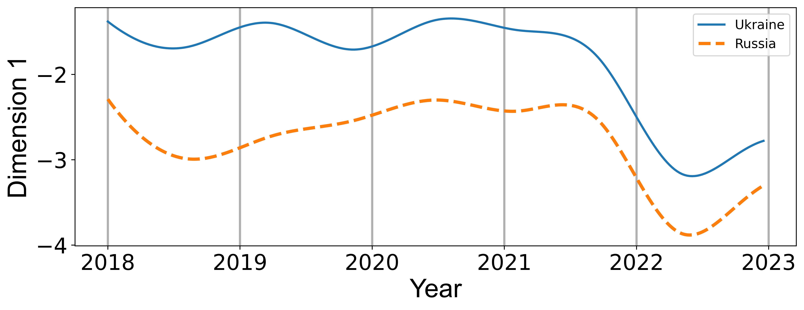

[](https://github.com/joshloyal/multidynet/blob/master/LICENSE)

## Fast Variational Inference of Dynamic LSMs using Bayesian P-Splines

*Author: [Joshua D. Loyal](https://joshloyal.github.io/)*

This package provides an interface for the model described in
"Fast Variational Inference of Latent Space Models for Dynamic Networks using Bayesian P-Splines." Inference is performed using
stochastic variational inference. For more details, see [Loyal (2023)]().

Dependencies
------------
``splinetlsm`` requires:

- Python (>= 3.10)

and the requirements highlighted in [requirements.txt](requirements.txt). To install the requirements, run

```python
pip install -r requirements.txt
```

Installation
------------
You need a working installation of numpy, scipy, and Cython to install ``splinetlsm``. In addition, the package uses OpenBLAS and the GNU Scientific Library (GSL), so you will need a C/C++ compiler and these libraries installed. Install these required dependencies before proceeding.  Use the following commands to get the copy from GitHub and install all the dependencies:

```
>>> git clone https://github.com/joshloyal/splinetlsm.git
>>> cd splinetlsm
>>> pip install -r requirements.txt
>>> python setup.py develop
```

Example
-------

```python
import matplotlib.pyplot as plt
import numpy as np

from splinetlsm import SplineDynamicLSM
from splinetlsm.datasets import load_polecat


# small version of polecat
Y, time_points, X, node_names, iso_codes, regions, time_labels = load_polecat(
        n_nodes=50)

Y.shape
#>>> (259, 50, 50)
time_points.shape
#>>> (259,)
X.shape
#>>> (259, 50, 50, 4)

# initialize a model with d = 6 latent space dimensions
model = SplineDynamicLSM(n_features=6, alpha=0.95)

# fit the model using SVI with a maximum of 50 iterations
model.fit(Y, time_points, X, max_iter=50)

# samples from the variational posterior are stored in model.samples_
# plot coefficient function
coefs = model.samples_['W_coefs'] @ model.B_fit_.todense()
coefs = coefs.transpose((0, 2, 1))
ci = np.quantile(coefs, q=[0.025, 0.5, 0.975], axis=0)

fig, ax = plt.subplots(figsize=(12,4))
labels = [
    r"$y_{ij,t_{m-1}}$",
    r"ConCoopDiff$_{ij,t_{m-1}}$",
    r'CommLang$_{ij}$',
    r'$\log($Dist$_{ij})$']

ls = ['-', '--', '-.', ':']
for k in range(X.shape[-1]):
    ax.plot(time_points, ci[1, :, k], linestyle=ls[k], lw=3, label=labels[k])
    ax.fill_between(time_points, ci[0, :, k], ci[2, :, k], alpha=0.25)

ax.axhline(0, linestyle='--', color='k')

ax.set_xticks([i * 52 for i in range(6)])
ax.set_xticklabels([2018 + i for i in range(6)], fontsize=20)
ax.tick_params(axis='both', which='major', labelsize=20)
ax.grid(axis='x', lw=2)
ax.set_xlabel('Year', fontsize=24, fontfamily='Arial')
ax.set_ylabel('Coefficients', fontsize=24, fontfamily='arial')
ax.legend(loc='upper center', ncols=4, fontsize=20, bbox_to_anchor=(0.5, 1.3))

plt.show()
```


```python
# plot the latent trajectories of Ukraine and Russia's first coordinate

# NOTE: model.U_ is a (n_time_points, n_nodes, n_features) ndarray holding the 
# variational posterior means of the latent trajectories that have been
# post-processed using sequential Procrustes rotations.
u_ukraine = model.U_[:, 7, 0]  # Ukraine is node 7
u_russia = model.U_[:, 1, 0]   # Russia is node 1

fig, ax = plt.subplots(figsize=(6, 4))
ax.plot(time_points, u_ukraine, linewidth=2, label='Ukraine')
ax.plot(time_points, u_russia, linestyle='--', linewidth=3, label='Russia')
ax.set_xticks([i * 52 for i in range(6)])
ax.set_xticklabels([2018 + i for i in range(6)], fontsize=20)
ax.tick_params(axis='both', which='major', labelsize=20)
ax.grid(axis='x', lw=2)
ax.set_xlabel('Year', fontsize=24, fontfamily='Arial')
ax.set_ylabel('Dimension 1', fontsize=24, fontfamily='arial')
ax.legend(fontsize=12)

plt.show()
```




Simulation Studies and Real-Data Applications
---------------------------------------------

The [scripts](scripts) directory includes the simulation studies and real-data application found in the article.
